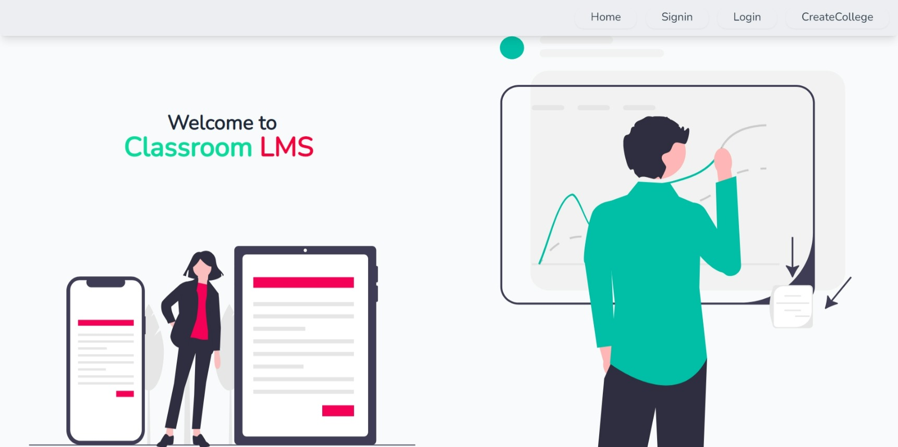
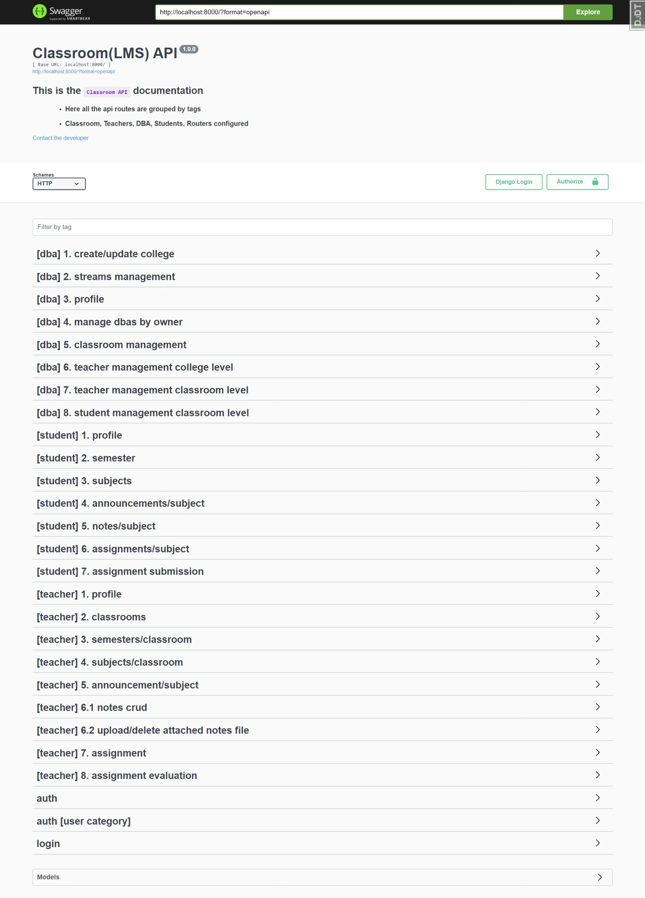
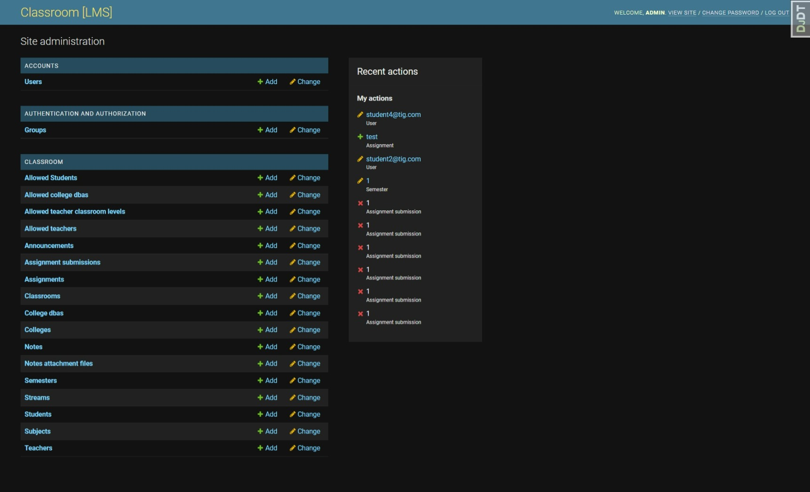
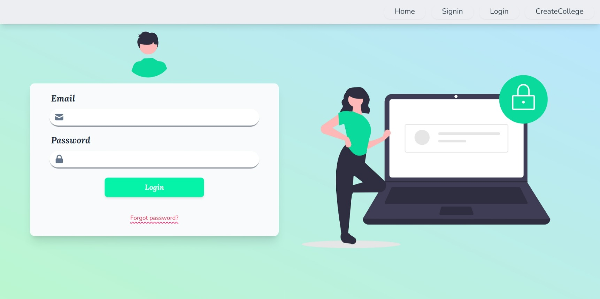
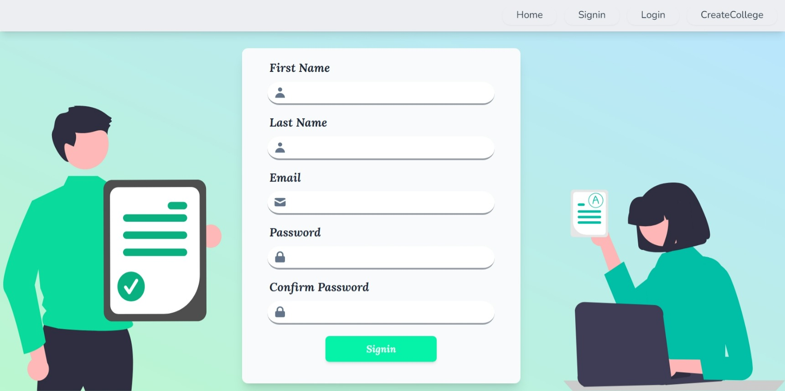
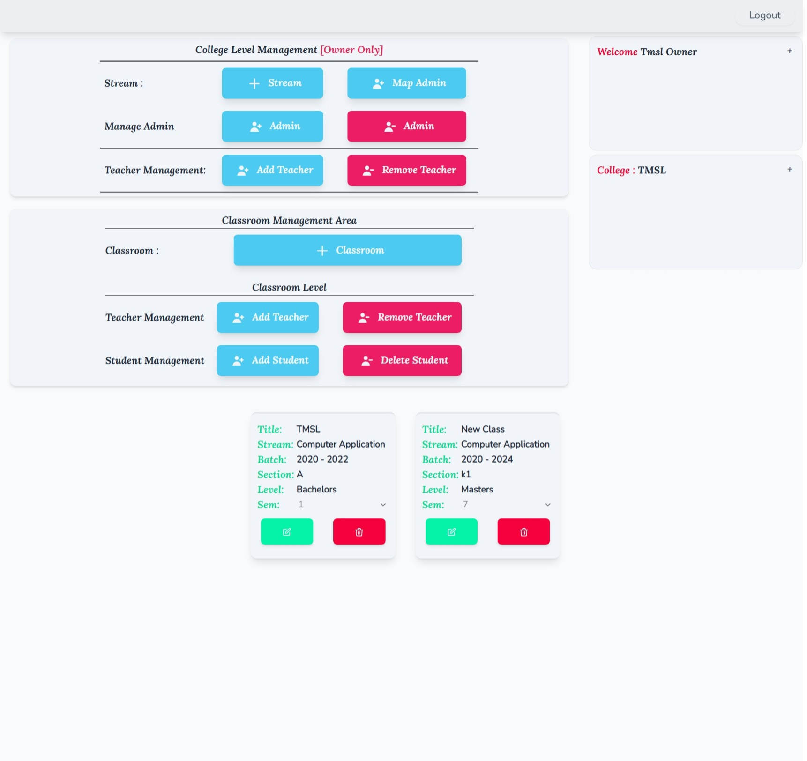
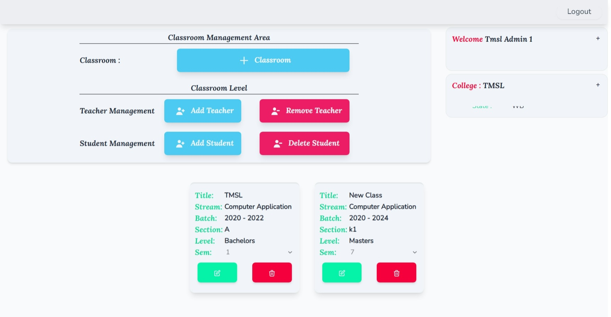
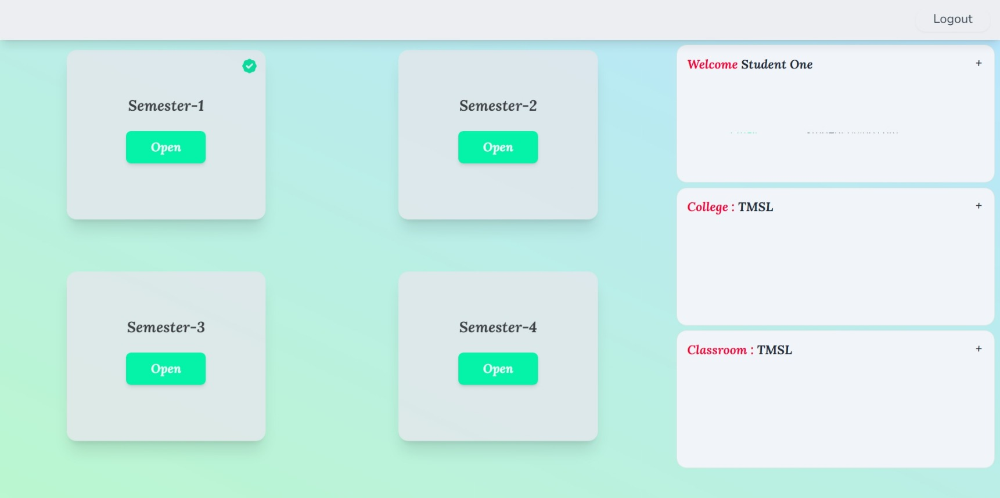
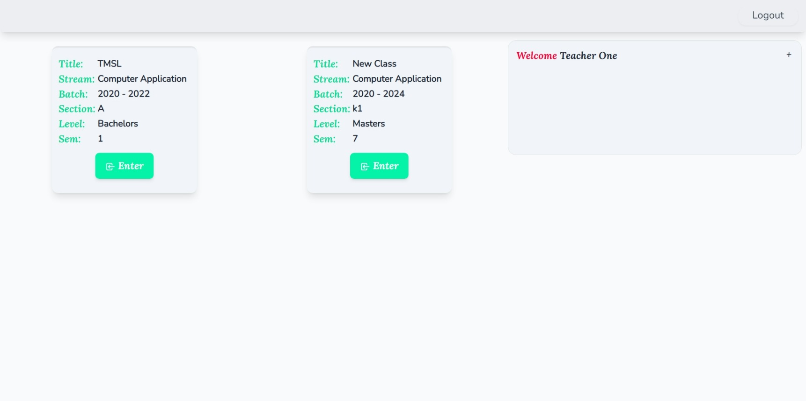

# Classroom LMS (Frontend)

---

## 

> ### This is the major project of MCA Sem-4.
>
> We developed a virtual classroom.
> 4 Modules are there.
>
> 1. Admin - Owner
> 1. Admin - with less privileges
> 1. Teacher
> 1. Student

---

# Technology Stack

---

<p float="left">


</p>

# Contributors

---

> - [@TathagataDas99 (Owner , Frontend Dev)](https://github.com/TathagataDas99)
> - [@PritamChk (Backend Dev & Designer)](https://github.com/PritamChk)

## Recommended IDE Setup

[VSCode](https://code.visualstudio.com/) + [Volar](https://marketplace.visualstudio.com/items?itemName=johnsoncodehk.volar) (and disable Vetur) + [TypeScript Vue Plugin (Volar)](https://marketplace.visualstudio.com/items?itemName=johnsoncodehk.vscode-typescript-vue-plugin).

## Customize configuration

See [Vite Configuration Reference](https://vitejs.dev/config/).

## Project Setup

```sh
npm install
```

### Compile and Hot-Reload for Development

```sh
npm run dev
```

### Compile and Minify for Production

```sh
npm run build
```

### Lint with [ESLint](https://eslint.org/)

```sh
npm run lint
```

# API Backend

> Backend of this project is Done By Pritam Chakraborty ([@PritamChk](https://github.com/PritamChk))

Backend Setup Documentation:

- ### [GitHub Link](https://github.com/PritamChk/ClassroomBackend)

---





api backend initial v0.0.1 heroku url : [Click Here](https://lms-classroom-api.herokuapp.com/)

---

## Some Screenshots

---

<p float="left">




 </p>

<p float="left">





</p>

<p float="left">




</p>
